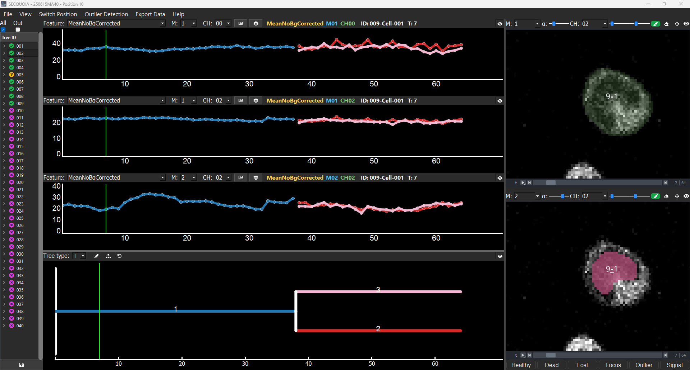

<p align="center">
  
</p>

[](https://github.com/CSDGroup/SECQUOIA/raw/main/LICENSE)
[](https://python.org)
[](https://github.com/CSDGroup/SECQUOIA/actions/workflows/test_and_deploy.yml)
[](https://codecov.io/gh/CSDGroup/SECQUOIA)
[](https://github.com/copier-org/copier)

**SECQUOIA** (**SE**gmentation, **C**uration, **QU**antification, and **O**utlier detection for **I**maging **A**nalysis) is a graphical user interface (GUI) for quantifying time lapse imaging datasets. It combines the following steps in one tool:

- Quantification of multiple masks and channels over time
- Efficient, user-friendly tools for tracking and segmentation-error curation
- Built-in outlier detection
- Channel and mask arithmetic
- Exploration of quantification results and raw data
- Export of single images and movies
- Cytometric analysis of time lapse data without requiring tracking data

## Contents

- [Installation](#installation)
- [How to get started](#how-to-get-started)
- [Load data](#load-data)
- [Navigate SECQUOIA's main window](#navigate-secquoias-main-window)
- [Switch to a different position](#switch-to-a-different-position)
- [Save and export data](#save-and-export-data)
- [Cytometric analysis](#cytometric-analysis)
- [Contributing](#contributing)
- [License](#license)
- [Issues](#issues)

## Installation

1. Open a terminal with conda available, e.g., the [Anaconda PowerShell Prompt](https://www.anaconda.com/docs/getting-started/miniconda/install) on Windows. Create a new conda environment and activate it:

```bash
conda create -n SECQUOIA python=3.12
conda activate SECQUOIA
```

2. Optional: install `git` if it is not already available.

```bash
conda install -c anaconda git
```

3. Move to the destination folder.

```bash
cd /path/to/destination/folder
```

4. Clone the repository.

```bash
git clone https://github.com/CSDGroup/SECQUOIA.git
```

### For users

Navigate to the `SECQUOIA` folder and install the package:

```bash
cd SECQUOIA
pip install .
```

### For developers

Navigate to the `SECQUOIA` folder and install the package in editable mode with the additional development dependencies:

```bash
cd SECQUOIA
pip install -e ".[testing]"
pre-commit install
```

`SECQUOIA` uses Python's standard [`logging`](https://docs.python.org/3/library/logging.html) module.

### Optional: btrack tracking data

If you plan to use btrack as your tracking format, install it into the same environment as SECQUOIA:

```bash
pip install "btrack>=0.7,<0.8"
```

## How to get started

1. Activate your conda environment:

```bash
conda activate SECQUOIA
```

2. Launch SECQUOIA:

```bash
SECQUOIA
```

The first launch may take a moment while all parameters are initialized.

## Load data

To load data into SECQUOIA:

1. Go to `View → Start a new project` or press `Ctrl+N`.
2. The loading window opens.
3. Follow the steps in the [loading-window documentation](docs/loading-window.md) to load an experiment.

Experiment data must be arranged according to the [tTt folder structure](docs/data-formats.md). A demo dataset is available in [`examples/`](examples/README.md).

## Navigate SECQUOIA's main window

The main window has five major sections:

1. [Menu bar](#menu-bar)
2. [Tree-ID selector](#tree-id-selector)
3. [Dynamics plots](docs/dynamics-plot.md)
4. [Lineage tree](docs/lineage-tree.md)
5. [Viewers](docs/viewer.md)



### Menu bar

The menu bar at the top of the main window gives access to all major GUIs and actions, grouped into `File`, `View`, `Switch Position`, `Outlier Detection`, `Export Data`, and `Help`.

### Tree-ID selector

- The left side of the main window lists all Tree-IDs found for the current position.
- Left-click a Tree-ID to select it. This automatically updates the [lineage tree](docs/lineage-tree.md), [dynamics plots](docs/dynamics-plot.md), and [viewers](docs/viewer.md).
- Pressing the `Up and Down arrow` keys changes the Tree-ID to the next or previous one.
- Each Tree-ID is collapsed by default. Click it to expand the list of TrackNumbers associated with that Tree-ID.
- The symbol next to each Tree-ID indicates its curation status:
  - Purple X: not checked yet
  - Yellow question mark: needs further checking
  - Green checkmark: checked
- Right-clicking a Tree-ID opens a menu for manually changing the curation state.
- Pressing `Ctrl while left-clicking` a Tree-ID cycles through the curation states.
- The same menu provides an option to mark a Tree-ID as deactivated. Deactivated Tree-IDs are displayed with a strikethrough style.

### Dynamics plots

The [dynamics plots](docs/dynamics-plot.md) are located next to the Tree-ID selector. They display the currently selected quantification for the selected Tree-ID.

- Use the dropdown above each plot to change the plotted feature for the selected mask and channel.
- Left-click a dynamics plot to switch the [viewers](docs/viewer.md) to the clicked time point and display the raw data for the selected Tree-ID.
- Use the eraser and paint tools above the viewers to curate incorrect or missing masks.
- Correct tracking errors by right-clicking a mask or using the [tracking toolbar](docs/tracking.md).
- The `Left and Right arrow` keys let you move to the next time point within a specific channel. The channel can be selected with `Ctrl+N`, where N stands for a number.

### Lineage tree
The [lineage tree](docs/lineage-tree.md), located below the dynamics plots, displays the cell history of the currently selected Tree-ID.

### Outlier detection

To help find errors introduced by automatic tracking and segmentation, run [outlier-detection](docs/outlier-detection.md) by selecting:

- `Outlier Detection → Outlier Detection` from the menu, or  `Ctrl+H`.

After outlier detection has run, identified outliers are highlighted in the dynamics plots with a yellow star.

## Switch to a different position

To switch to a different position in an experiment, use one of the following options:

- `Switch Position → Previous Position` or `Ctrl+Shift+Left`
- `Switch Position → Next Position` or `Ctrl+Shift+Right`
- `Switch Position → Select Position` or `Ctrl+Shift+O`

After selecting an option, a loading window with a progress bar appears and indicates when the next position has finished loading.

## Save and export data

To save curated data, use one of the following options:

- Click the `Save` button under the Tree-ID selector.
- Press `Ctrl+S`.
- Select `File → Save Data`.

SECQUOIA saves and exports all quantified and curated data to the experiment folder, including:

- Quantification results as [.csv](docs/data-formats.md) files
- Curated masks
- A `.json` metadata file for reloading the project

To [export images or movies](docs/image-and-movie-export.md), use `Export Data → Export Single Images or Movies`  or `Ctrl+E`. This GUI allows to design layouts with selected Tree-IDs and export them as images or movies.

## Cytometric analysis

SECQUOIA enables [cytometric analysis](docs/cytometric-analysis.md) to extract fluorescence and morphological features from all cells over time without requiring tracking data.

Launch the cytometric analysis GUI via `File → Cytometric Analysis` or `Ctrl+F`.

## Contributing

Contributions are very welcome. Tests can be run with [tox], please ensure the coverage at least stays the same before you submit a pull request.

## License

Distributed under the terms of the [BSD-3] license, SECQUOIA is free and open-source software.

## Issues

If you encounter any problems, please [file an issue] with a detailed description.

---

This GUI was generated with [copier] using the [napari-plugin-template].

---

[copier]: https://copier.readthedocs.io/en/stable/
[BSD-3]: http://opensource.org/licenses/BSD-3-Clause
[napari-plugin-template]: https://github.com/napari/napari-plugin-template
[file an issue]: https://github.com/CSDGroup/SECQUOIA/issues
[tox]: https://tox.readthedocs.io/en/latest/
