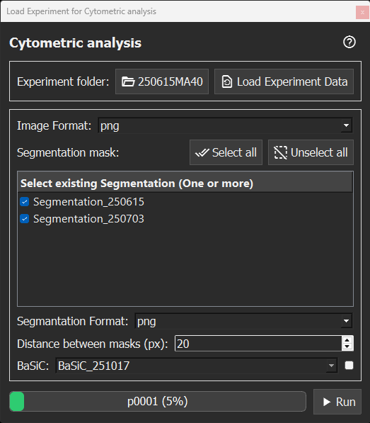

# Cytometric Analysis

Cytometric analysis uses one or more segmentation masks to extract fluorescence intensity and morphological information from image data. Tracking data is not required. For each mask, quantifications are collected over time and saved as `.csv` files for each position. When multiple segmentation masks are selected, objects from different masks can be matched based on centroid proximity within a user-defined distance threshold.

## How to use the Cytometric Analysis GUI

1. Select the experiment folder following the [tTt folder structure](data-formats.md).
2. Click `Load Experiment Data`. The segmentation path and BaSiC background correction (if present) are detected automatically.
3. Select the image format (e.g., `.png`).
4. Select one or more segmentation folders.
5. Select the image format of the segmentation masks (e.g., `.png`).
6. (Optional) Select the [BaSiC](https://github.com/peng-lab/BaSiCPy) folder and enable BaSiC background correction if it should be applied.
7. Define the distance threshold in pixels used to match objects between masks when multiple masks are selected.
8. Click `Run`. Progress is shown in the status bar.
9. CSV files are saved in the experiment’s Analysis/Cytometric_Analysis folder. For each selected segmentation mask, one CSV file is generated per position, for example `Cytometric_Analysis_p0001_M1.csv` or `Cytometric_Analysis_p0001_M2.csv`. If multiple masks are selected, an additional matched file is created, for example `Cytometric_Analysis_p0001_matched.csv`.

## Cytometric analysis CSV columns

[scikit-image](https://scikit-image.org/) is used to extract fluorescence and morphological information from segmentations. Mask-specific columns use the suffix `M#`, for example `M1` or `M2`. Channel-specific intensity columns include the channel identifier, for example `Ch01`, `Ch02`, etc.

| Column pattern | Description |
| --- | --- |
| `AreaMorphologyM#` | Mask area in pixels. |
| `AxisMajorLengthM#` | Length of the major axis of the mask. |
| `AxisMinorLengthM#` | Length of the minor axis of the mask. |
| `CVBaSiCBgCorrectedNoRatioFlatChXXM#` | Corrected intensity coefficient of variation, calculated as `Std / Mean`. |
| `CVBaSiCBgCorrectedRatioFlatChXXM#` | Corrected intensity coefficient of variation, calculated as `Std / Mean`. |
| `CVNoBgCorrectedChXXM#` | Raw intensity coefficient of variation, calculated as `Std / Mean`. |
| `EccentricityM#` | Shape eccentricity of the mask. |
| `labelM#` | Unique label of the segmented mask `M#`. |
| `MeanBaSiCBgCorrectedNoRatioFlatChXXM#` | Mean fluorescence intensity after BaSiC background correction. Only present when BaSiC correction is enabled. |
| `MeanBaSiCBgCorrectedRatioFlatChXXM#` | Mean fluorescence intensity after BaSiC background correction using ratio-flat correction. |
| `MeanNoBgCorrectedChXXM#` | Mean raw fluorescence intensity inside a mask for channel `ChXX`, without background correction. |
| `OrientationM#` | Mask orientation angle. |
| `Position` | Position folder. |
| `StdBaSiCBgCorrectedNoRatioFlatChXXM#` | Standard deviation of BaSiC no-ratio-flat corrected fluorescence intensity. |
| `StdBaSiCBgCorrectedRatioFlatChXXM#` | Standard deviation of BaSiC ratio-flat corrected fluorescence intensity. |
| `StdNoBgCorrectedChXXM#` | Standard deviation of raw mask intensity for channel `ChXX`. |
| `SumBaSiCBgCorrectedNoRatioFlatChXXM#` | Sum BaSiC no-ratio-flat corrected intensity. |
| `SumBaSiCBgCorrectedRatioFlatChXXM#` | Sum BaSiC ratio-flat corrected intensity. |
| `SumNoBgCorrectedChXXM#` | Sum raw fluorescence intensity. |
| `tM#` | Time point. |
| `timepoint` | Shared time point used when matching objects across multiple masks. |
| `TouchingBorderM#` | Flag indicating whether a segmentation mask touches the image border (=1) or not (=0). |
| `XMorphologyM#` | X-coordinate of the mask centroid in pixels. |
| `YMorphologyM#` | Y-coordinate of the mask centroid in pixels. |
