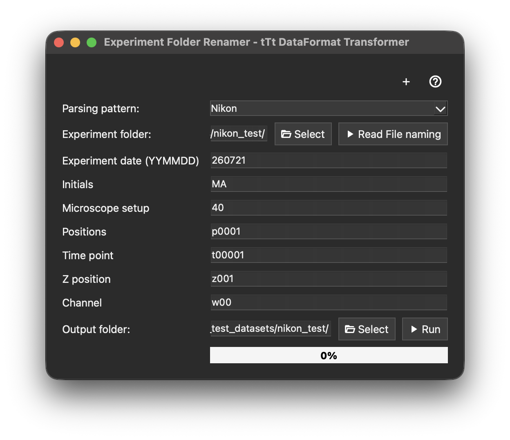

# Data formats

`SECQUOIA` uses the tTt folder structure for data import. This structure starts with the correct naming of the experiment folder and continues down to the individual image and result files.

## Experiment folder naming

The experiment folder name consists of three parts:

1. Date (YYYYMMDD), for example: `20251129`
2. User initials, for example: `MA`
3. Microscope setup number, for example: `01`

Putting this together gives the experiment name `20251129MA01`. This experiment folder is the root of the tTt structure.

## Position subfolders and image files

Within the experiment folder, there are subfolders for each position. These subfolders are named using the experiment name plus the position index, for example:

```text
240323MA35_p0001
240323MA35_p0002
```

Inside each position folder are the `8-bit .png` images. A 16-bit to 8-bit converter can be found on the [CSD website](https://bsse.ethz.ch/csd/software/ttt-and-qtfy.html). The images follow a specific naming convention. For example `240323MA35_p0001_t00001_z001_w00.png`.

This name can be read as:

- `240323MA35_p0001` – experiment name and position
- `t00001` – time point
- `z001` – z position
- `w00` – channel

The image naming is important because the software reads these parts to extract the necessary metadata.

> **Note:**
> Currently, only a single z layer (`z001`) is supported in SECQUOIA.

## TATexp.xml file (only required when using tTt tracking)

The `TATexp.xml` file contains:

- Position information
- Comments
- `micrometerPerPixel`
- Channel information
- Other metadata

Some of this information is parsed during the [loading window](/docs/loading-window.md) in SECQUOIA. The `TATexp.xml` file must be located in the experiment folder. This file is only needed when `tTt` is selected as the tracking format and is automatically produced when using the [8-bit converter](https://bsse.ethz.ch/csd/software/ttt-and-qtfy.html).

## Import real time from `image.csv` (optional)

SECQUOIA can import the real time at which an image was taken. For this, the file `image.csv` needs to be located in the experiment folder and must contain the columns `Measurement Time (ms)` and `Image File`. This import is optional.

## Analysis folder and segmentation

In addition to the position folders, there is one extra subfolder in the experiment folder called `Analysis`. This folder contains several subfolders needed for quantification.

### Segmentation folder

The `Analysis` folder contains the segmentation mask folders, whose names start with `Segmentation_`. If a folder name starts with `Segmentation_`, it is automatically detected and displayed in the [loading window](/docs/loading-window.md).

The segmentation folder follows the tTt structure as described above. It includes subfolders named like `251014MA40_p0001`. These subfolders contain the specific segmentation masks per time point as `.png` files. The naming convention is similar to the one described above. The segmentation masks only have an extra part, `_m00_mask`, in their name, for example `240323MA35_p0001_t00001_z001_w00_m00_mask.png`.

The correct segmentation folder structure is directly produced when segmentations are performed with [fastER](https://bsse.ethz.ch/csd/software/faster.html) or [aiSEGcell](https://bsse.ethz.ch/csd/software/aisegcell.html). Other segmentation software can also be used to generate segmentation masks, but the masks then have to be rearranged into the tTt format.

## Background correction with BaSiC (optional)

Also in the `Analysis` folder, there can be a background-corrected folder produced by [BaSiC](https://github.com/peng-lab/BaSiCPy). If the folder name starts with `BaSiC_`, it will be automatically detected. The BaSiC folder is not required to run SECQUOIA.

## Output folders created by SECQUOIA

Depending on the tracking format selected during loading, one of the following output folders is created:

- `SECQUOIA_files_btrack`
- `SECQUOIA_files_CTC`
- `SECQUOIA_files_tTt`
- `SECQUOIA_files_Ultrack`

Depending on the chosen project name during [loading](/docs/loading-window.md), a project folder is created within one of the folders above.

The project folder can contain different data created while working with SECQUOIA, such as:

- `project_metadata.json`
- `.csv` files containing quantifications
- Exported images or movies
- Exported settings

### Per-position `.csv` files

For each position, a new CSV file is created. These files can be reloaded later to avoid repeating time-consuming quantifications. Files are named like `SECQUOIA_p0001_t00001-00026_m2_ch5.csv.

This name can be interpreted as:

- `p0001` – position
- `t00001-00026` – time points used for the analysis (1–26)
- `m2` – number of masks used
- `ch5` – number of channels

### Combined `.csv` file

The folder also contains a `.csv` file called `Updated_CSV_File.csv`. This single file contains quantifications from all positions.

## Supported tracking formats

`SECQUOIA` supports four tracking formats:

- [btrack](https://github.com/quantumjot/btrack?tab=readme-ov-file)
- [Cell Tracking Challenge (CTC)](https://celltrackingchallenge.net/)
- [tTt](https://bsse.ethz.ch/csd/software/ttt-and-qtfy.html)
- [Ultrack](https://github.com/royerlab/ultrack)

### btrack tracking format

> **Note:**
> Install btrack into the same environment before loading btrack data:
> ```bash
> pip install "btrack>=0.7,<0.8"
> ```

Export the [btrack](https://github.com/quantumjot/btrack?tab=readme-ov-file) tracking data as an `.h5` file. Each position should have its own separate `.h5` file, saved in a subfolder following the structure below:

```text
|-- Analysis/
    |-- Tracking_btrack/
    |   |-- 20251129MA01_p0001/
    |   |   |-- [file].h5
    |   |-- 20251129MA01_p0002/
    |   |   |-- [file].h5
```

### CTC tracking format

Several programs, including [TrackMate](https://imagej.net/plugins/trackmate/), [Ilastik](https://www.ilastik.org/), and [Trackastra](https://github.com/weigertlab/trackastra), can export tracking results in [CTC format](https://celltrackingchallenge.net/). The CTC format provides `maskXX.tif` files for each time point and a `res_track.txt` file. Each position should be stored in its own subfolder, as shown below:

```text
|-- Analysis/
    |-- Tracking_CTC/
    |   |-- 20251129MA01_p0001/
    |   |   |-- mask00.tif
    |   |   |-- mask01.tif
    |   |   |-- ...
    |   |   |-- res_track.txt
    |   |-- 20251129MA01_p0002/
    |   |   |-- mask00.tif
    |   |   |-- mask01.tif
    |   |   |-- ...
    |   |   |-- res_track.txt
```

### tTt tracking format

Detailed information for tTt can be found on the [CSD website](https://bsse.ethz.ch/csd/software/ttt-and-qtfy.html). When using the tTt tracking software, it produces `.CLT` / Tree-ID files in the correct folder structure, which can be directly read by SECQUOIA.

### Ultrack tracking format

For [Ultrack](https://github.com/royerlab/ultrack), one `.csv` file per position is required, and it must contain the following columns: `track_id`, `t`, `x`, `y`, and `parent_track_id`. Each position's `.csv` file should be saved in a separate subfolder, as shown below:

```text
|-- Analysis/
    |-- Tracking_Ultrack/
    |   |-- 20251129MA01_p0001/
    |   |   |-- [file].csv
    |   |-- 20251129MA01_p0002/
    |   |   |-- [file].csv
```

## Example tTt folder structure

Below is an example scheme of the tTt folder structure using a hypothetical experiment `20251129MA01`:

```text
20251129MA01/
|-- TATexp.xml
|-- image.csv
|-- 20251129MA01_p0001/
|   |-- 20251129MA01_p0001_t00001_z001_w00.png
|   |-- 20251129MA01_p0001_t00002_z001_w00.png
|   |-- ...
|-- 20251129MA01_p0002/
|   |-- 20251129MA01_p0002_t00001_z001_w00.png
|   |-- ...
|-- Analysis/
    |-- Segmentation_<description>/
    |   |-- 20251129MA01_p0001/
    |   |   |-- [segmentation masks]
    |   |-- 20251129MA01_p0002/
    |       |-- [segmentation masks]
    |-- BaSiC_<description>/
    |   |-- ...
    |-- SECQUOIA_files_tTt/
    |   |-- SECQUOIA_p0001_t00001-00026_m2_ch5.csv
    |   |-- Updated_CSV_File.csv
    |   |-- ...
```

## tTt Data Format Transformer

This tool renames and restructures exported images into the tTt folder format.

1. Select an experiment folder.
2. Click `Read File Naming` to auto-fill the fields based on the first image filename. Common naming patterns, such as `xy` for position, `t` for time point, `z` for z position, and `c` for channel, are detected automatically. More patterns can be added [here](src/SECQUOIA/gui/ttt_data_format_transformer.py ).
3. Edit the fields if needed.
4. Select an output folder.
5. Click `Run`. Progress is shown in the progress bar.
6. Optional: If the images are 16-bit, they need to be converted into 8-bit. This step can be done using the [tTt Converter](https://bsse.ethz.ch/csd/software/ttt-and-qtfy.html).



## Exported .csv files by SECQUOIA

[scikit-image](https://scikit-image.org/) is used to extract fluorescence and morphological information from segmentation over time. Mask-specific columns use the suffix `M#` (for example, `M1` or `M2`). Channel-specific intensity columns include the channel identifier (for example, `Ch01`, `Ch02`).

| Column pattern                          | Description                                                                                                                                        |
| --------------------------------------- | -------------------------------------------------------------------------------------------------------------------------------------------------- |
| `active`                                | Display if a Tree-ID is marked as active (1) or deactivated (0).                                                                                   |
| `AreaMorphologyM#`                      | Mask area in pixels.                                                                                                                               |
| `AxisMajorLengthM#`                     | Length of the major axis of the mask.                                                                                                              |
| `AxisMinorLengthM#`                     | Length of the minor axis of the mask.                                                                                                              |
| `Calculated_Time`                       | Time calculated using user input.                                                                                                                  |
| `CVBaSiCBgCorrectedNoRatioFlatChXXM#`   | Corrected intensity coefficient of variation, calculated as `Std / Mean`.                                                                          |
| `CVBaSiCBgCorrectedRatioFlatChXXM#`     | Corrected intensity coefficient of variation, calculated as `Std / Mean`.                                                                          |
| `CVNoBgCorrectedChXXM#`                 | Raw intensity coefficient of variation, calculated as `Std / Mean`.                                                                                |
| `EccentricityM#`                        | Shape eccentricity of the mask.                                                                                                                    |
| `inspected`                             | Shows the inspection status of a Tree-ID (Not checked = 0, Needs further Checking = 1, checked = 2).                                               |
| `label_id_m#`                           | Unique label of the segmented mask `M#`.                                                                                                           |
| `MaxBaSiCBgCorrectedNoRatioFlatChXXM#`  | Maximum fluorescence intensity after BaSiC background correction without ratio-flat correction.                                                    |
| `MaxBaSiCBgCorrectedRatioFlatChXXM#`    | Maximum fluorescence intensity after BaSiC background correction using ratio-flat correction.                                                      |
| `MaxNoBgCorrectedChXXM#`                | Maximum raw fluorescence intensity inside a mask for channel `ChXX`, without background correction.                                                |
| `MeanBaSiCBgCorrectedNoRatioFlatChXXM#` | Mean fluorescence intensity after BaSiC background correction without ratio-flat correction.                                                       |
| `MeanBaSiCBgCorrectedRatioFlatChXXM#`   | Mean fluorescence intensity after BaSiC background correction using ratio-flat correction.                                                         |
| `MeanNoBgCorrectedChXXM#`               | Mean raw fluorescence intensity inside a mask for channel `ChXX`, without background correction.                                                   |
| `MinBaSiCBgCorrectedNoRatioFlatChXXM#`  | Minimum fluorescence intensity after BaSiC background correction without ratio-flat correction.                                                    |
| `MinBaSiCBgCorrectedRatioFlatChXXM#`    | Minimum fluorescence intensity after BaSiC background correction using ratio-flat correction.                                                      |
| `MinNoBgCorrectedChXXM#`                | Minimum raw fluorescence intensity inside a mask for channel `ChXX`, without background correction.                                                |
| `nn_dist_px_m#`                         | Nearest neighbor distance in pixels between track and matched mask.                                                                                |
| `OrientationM#`                         | Mask orientation angle.                                                                                                                            |
| `PerimeterMorphologyM#`                 | Perimeter of the mask boundary in pixels.                                                                                                          |
| `Position`                              | Position folder or field of view.                                                                                                                  |
| `step_disp_px_m#`                       | Per-frame step displacement in pixels, computed as distance between consecutive time points.                                                       |
| `StdBaSiCBgCorrectedNoRatioFlatChXXM#`  | Standard deviation of BaSiC no-ratio-flat corrected fluorescence intensity.                                                                        |
| `StdBaSiCBgCorrectedRatioFlatChXXM#`    | Standard deviation of BaSiC ratio-flat corrected fluorescence intensity.                                                                           |
| `StdNoBgCorrectedChXXM#`                | Standard deviation of raw mask intensity for channel `ChXX`.                                                                                       |
| `SumBaSiCBgCorrectedNoRatioFlatChXXM#`  | Sum BaSiC no-ratio-flat corrected intensity.                                                                                                       |
| `SumBaSiCBgCorrectedRatioFlatChXXM#`    | Sum BaSiC ratio-flat corrected intensity.                                                                                                          |
| `SumNoBgCorrectedChXXM#`                | Sum raw fluorescence intensity.                                                                                                                    |
| `t`                                     | Time points.                                                                                                                                       |
| `TrackNumber`                           | Each cell has its own track number within colony.                                                                                                  |
| `XMorphologyM#`                         | X-coordinate of the mask centroid in pixels.                                                                                                       |
| `YMorphologyM#`                         | Y-coordinate of the mask centroid in pixels.                                                                                                       |
