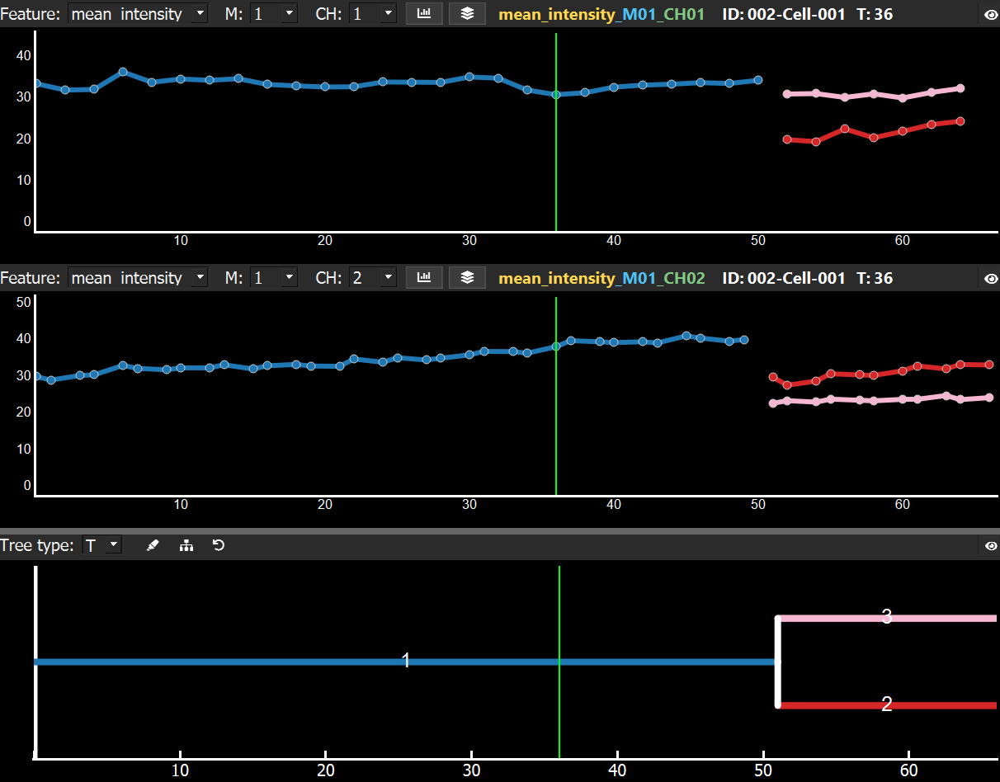
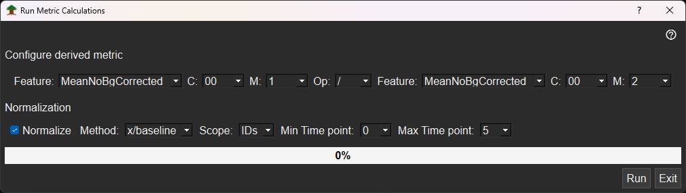
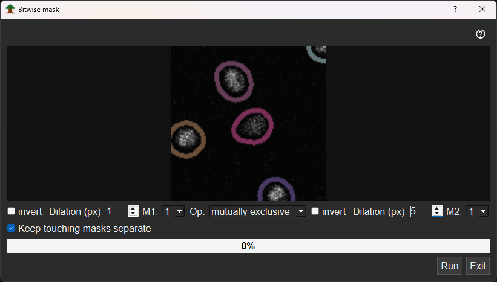
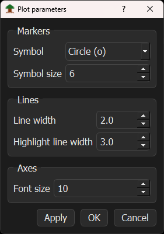

# Dynamics plots

The Dynamics plots display the quantification for the currently selected Tree-ID. Different track numbers and generations are shown in different colors, matching the colors in the [Lineage Tree](/docs/lineage-tree.md) below. The plotted feature can be changed using the `Feature` dropdown. The `Mask (M:)` and `Channel (CH:)` can also be selected through their respective dropdowns. All dropdowns are located above the Dynamics plots.

Next to the Channel dropdown, there are two buttons:

* Mask and channel arithmetic – opens the metric calculation window.
* Mask modification – opens a window to modify all masks simultaneously.

Next to these buttons, colored labels indicate the currently plotted Feature (yellow), Mask (blue), and Channel (green). In the same header area, the current Tree-ID, for example `ID:001`, track number, for example `Cell-001`, and current time point, `T:`, are shown.

The eye icon collapses or expands the Dynamics plot. Additional Dynamics plots can be added through `View -> Dynamics Plots -> Add Dynamics plot` or `Ctrl+Shift+=`, and existing plots can be removed through `View -> Dynamics Plots -> Remove Dynamics plot` or `Ctrl+Shift+-`.

Using the splitter above the [Lineage Tree](/docs/lineage-tree.md), or the splitter next to the [Viewers](/docs/viewer.md), the size of the Dynamics plots can be adjusted.

## Interaction with the feature plots

### Left-click

Left-clicking on a Dynamics plot changes the current time point. The green time-marker line moves to the clicked time point in all Dynamics plots and in the Lineage Tree. The [viewers](/docs/viewer.md) are updated accordingly.

### Right-click and context menu

Drawing a yellow rectangle over a specific area of a Dynamics plot zooms into that region. Clicking the `A` in the lower-left corner of the plot, or pressing `Ctrl+Q`, resets the zoom.

Right-clicking on the Dynamics plots opens a context menu with four options:

* X axis – change the x-axis settings.
* Y axis – change the y-axis settings.
* Change time plotting – change the time display to either Time point, Time calculated, or Real time, if real-time information is available.
* Export – export the current Dynamics plot.

## Mask and channel arithmetic window

The `Mask and channel arithmetic` window allows you to compute new features using different mathematical operations on combinations of features, channels, and masks for each unique Tree-ID.

Users can freely combine features, channels, and masks using basic mathematical operations: `/`, `*`, `+`, and `-`.

The window also supports z-score normalization and baseline normalization. For baseline normalization, each value is divided by a mean baseline value defined by the minimum and maximum time points.

The normalization scope can also be selected:

* `Scope-IDs` – applies the baseline separately to each Tree-ID.
* `Scope-All` – computes the normalization based on the mean of all currently loaded Tree-IDs.

After clicking `Run`, the new feature is added to all exported `.csv` files and becomes available as a feature in the dropdown menus above the Dynamics plots.

Arithmetic operations can be removed from the dropdown menus and `.csv` files by right-clicking on the dropdown and selecting `Delete selected derived Metric`.

## Mask arithmetic window

Clicking the `Mask Symbol`, the second button above each Dynamics plot, opens the `Mask arithmetic` window. This window allows you to modify existing masks and create new masks.

The GUI shows a snapshot of the current channel with overlaid masks. When users apply modifications, the masks are updated immediately with visual feedback in the preview.

### Mask selection and operations

The `M1` dropdown defines which mask is currently shown in the preview. The selected mask can be inverted by checking the `Invert` checkbox. It can also be dilated by choosing a positive value, for example `+2`, or eroded by choosing a negative value, for example `-3`.

### Operations between masks

Set the operation dropdown from `None`, which ignores `M2`, to one of the following options:

* `Intersection (AND)`
* `Union (OR)`
* `Mutual exclusion (XOR)`

The second mask, `M2`, can also be modified independently.

### Creating the new mask

Once the appropriate settings are defined, click `Run` to generate a new mask for all positions. A new mask folder is also created in the `Analysis` folder. The [viewers](/docs/viewer.md) and `Dynamics Plots` will then list the new mask in the `Mask` dropdown.

## Dynamics plot parameters

Clicking `View -> Plot parameters`  or `Ctrl+Shift+D` opens the `Plot parameters` GUI. This GUI allows you to change the plotting style of all Dynamics plots.

The following parameters can be updated through the Plot parameters GUI:

* Change the `symbol` used for the data points.
* Adjust the `symbol size`.
* Modify the `line thickness`.
* Control whether the `highlight colors` from the [Lineage Tree](/docs/lineage-tree.md) painting function are applied.
* Increase or decrease the `font size` of the axis labels.

Click `Apply` to apply the new settings to all Dynamics plots.

Click `Cancel` to close the GUI without applying changes.
