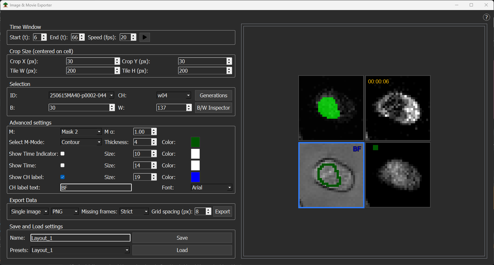

# Image and Movie Export

The `Image and Movie Exporter` allows you to design layouts of different Tree-IDs with different channels, overlaid masks, and additional information, then export either as single images (`.png`, `.tif`) or as movies (`.avi`, `.mp4`, `.gif`, `stack.tif`). The exporter can be opened through `Export data → Export Single Images or Movies` or `Ctrl+E`.

The Image and Movie Exporter GUI is divided into two main parts:

- On the left: the `Control panel` with all options to modify the layout.
- On the right: the `Image preview` showing the current layout.

## Image preview
By default, a single image is loaded into the layout. Additional images can be added by `right-clicking` next to the current image in the preview and selecting `Add image`. This allows to design the layout as needed (e.g. multiple images). `Right-clicking` on an image opens a menu with either `Remove` (removes the selected image) or `Reset` (returns to the default single-image layout).

## Control panel

The control panel is divided into several sections:

1. Time Window
2. Crop size
3. Selection
4. Advanced settings
5. Export data
6. Save and load settings

## Time Window

The Time Control section specifies which time points are included in the exported images or movies.

- Start (t) – the starting time point of the export.
- End (t) – the final time point of the export.
- Animation speed (frames per second) – the playback speed for movies.
- Play button – plays the current layout movie.

## Crop Size

The crop size section defines the dimensions and area of each image displayed.

- Tile H (px) – the tile height in pixels.
- Tile W (px) – the tile width in pixels.
- CropX (px) – zoom into a specific horizontal region.
- CropY (px) – zoom into a specific vertical region.

## Selection

- Tree-ID (ID:) – select the Tree-ID to display in the current image.
- Channel (CH:) – select the channel to display.
- B/W Inspector – opens a GUI to adjust the black (B:) and white (W:) points of the selected channel.
- Generations – opens a GUI to select specific generations to include in the export.

## Advanced Settings

The Advanced Settings section allows you to overlay masks and additional labels on the images.

### Mask Overlay

- Mask (M:) – choose which mask to overlay on the image.
- Mask opacity (M α:) – adjust the opacity of the mask.
- Full mask – display the entire mask.
- Contour – display the outline of the mask. The line thickness, opacity, and mask color can be set via a dropdown.

### Time Indicator and Text

- Enable by checking `Show Time Indicator`.
- Adjust the size and color of the time indicator.
- Enable time as text by checking `Show Time`.
- Adjust the `font size` and `text color`.

### Channel Label

- Enable `Show CH Label`.
- Adjust the `font size` and `text color` of the label.

By default, the channel label displays the original channel name (for example, `w02` from the image metadata). You can enter a custom label into the `CH label text` field.

## Export Data

Export layouts as:

- Single images (`.png`, `.tif`)
- Animations (`.gif`, `.avi`, `.mp4`. `.tif`)

In experiments with `staggered acquisition`, some time points might not contain images for certain channels (missing frames). The exporter provides different strategies to handle this:

- `Strict` – include all time points.
- `Hold last` – use the last available frame.
- `Nearest` – use the nearest available frame.

Click `Export` to export the selected format(s). The files are saved in the experiment folder under `Analysis/SECQUOIA_files`.

## Save and Load Layout Settings

- Clicking `Save` stores the current layout and all associated parameters as a `.json` file.
- To reload a layout, select a layout from the dropdown and click `Load` to restore the layout and all its saved settings.

