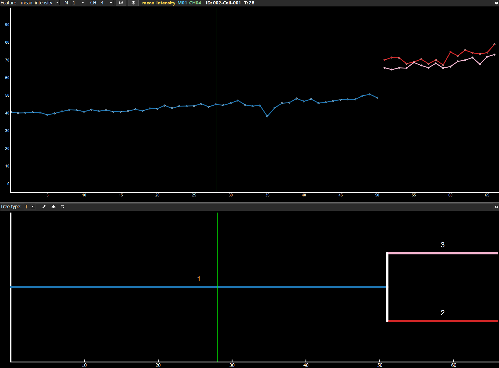
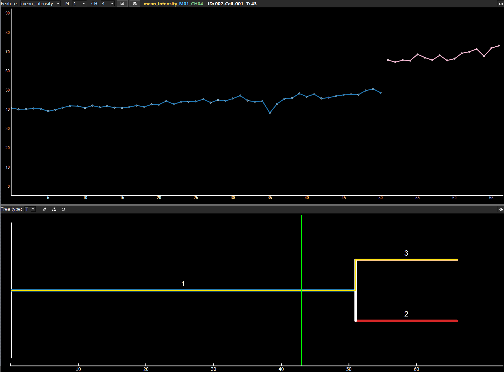
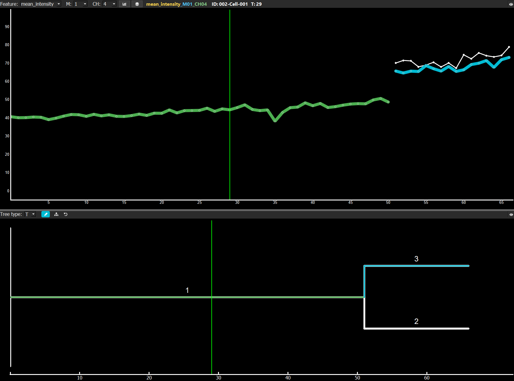
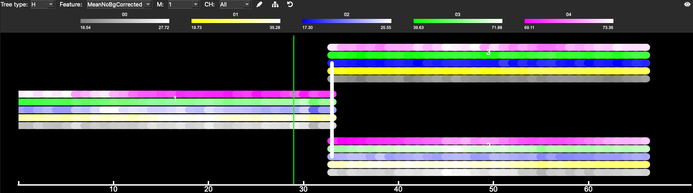
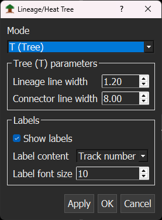
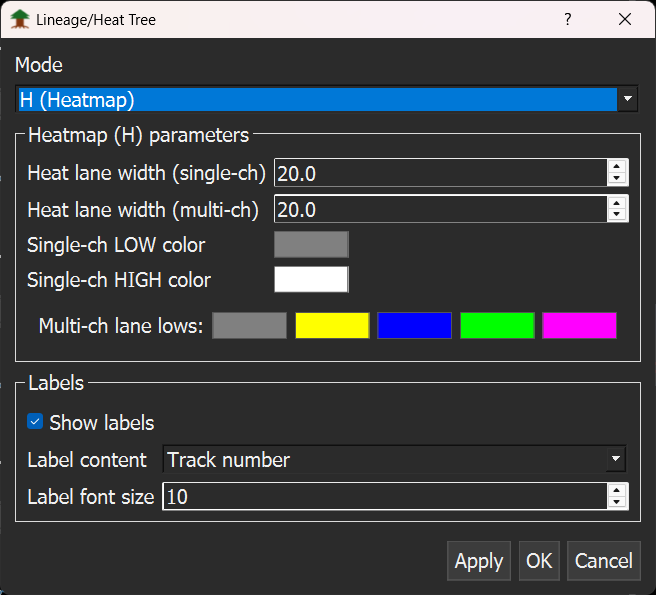

# Lineage Tree

The lineage tree displays the complete history of an entire colony, starting from a single initial cell and including all resulting cell divisions, cell deaths, or cell lost events.

The lineage tree is always plotted below the [dynamics plots](/docs/dynamics-plot.md). You can adjust the plot size along both the x- and y-axes by moving the splitter. The entire lineage tree can be collapsed by clicking the eye symbol in the upper-right corner.

A green line indicates the current time point. You can left-click in the plots to change the current time point within the same Tree-ID or jump to the selected track number in the lineage tree.

Right-clicking anywhere in the lineage tree opens a context menu with the following options:

- `X axis` – adjust axis parameters
- `Y axis` – adjust axis parameters
- `Change time plotting` – switch between `time point`, `time`, or `Real time`
- `Export` – save the current lineage tree

Draw a yellow rectangle over a specific area of the lineage tree to zoom into that region. Hold `Shift and left-click` to move the entire tree along the x- and y-axes.

Above the lineage tree, a dropdown menu allows you to switch between display modes:

- `T` – Lineage Tree (standard mode)
- `H` – Heat Tree (heatmap mode)

## Lineage Tree (T mode)

In T mode, the lineage tree displays the lineage structure of mother and daughter cells. Tree colors match those used in the [dynamics plots](/docs/dynamics-plot.md).

Press `Ctrl and left-click` on a specific generation or track number to display only that track in the plots, allowing you to focus on specific generations. Use `Ctrl + Left-click` on a track or generation line to select or deselect it.

Click the `Highlight` button or use the `Ctrl+A` hotkey to select the entire tree, displaying all data from all cells in the current Tree-ID in the plots. To clear all highlight selections, click the `Redo highlight selection` button or use `Ctrl+Shift+A`.

## Painting and Color Highlighting

Click the `pen` symbol or press `Ctrl+P` to activate color highlight mode for the lineage tree. The pen icon background changes to the current color, and all lineage lines turn white. Press `Ctrl and left-click` on a white track or generation line to paint it in the selected color. Click again with `Ctrl+Left-click` to remove the color.

Right-click on the pen icon to open a menu with the following options:

- Choose different colors for highlighting
- Clear all painted highlights
- Change colors using `Ctrl+Shift+P`

## Heat Tree (H mode)

In H mode, the lineage tree can be displayed as a heat tree, where specific feature values determine the color mapping (heatmap).

At the top of the Heat Tree view, you can select:

- One `feature` for coloring
- One `mask`
- A `channel` mode: either `all channels` or a single selected channel

## Lineage and Heat Tree Parameters

Open the Lineage and Heat Tree parameters window by selecting `View → Lineage parameters` or pressing `Ctrl+Shift+L`. This allows you to adjust the lineage tree parameters.

### T Mode Parameters

- Change the `line thickness` of the tree
- Display `Track number` (default) or `Generation` as labels
- Adjust the `font size` of labels
- Click `Apply` to apply changes to the Lineage Tree

### H Mode Parameters

- Change `line thickness` and `track number` display, similar to T mode
- Adjust `color settings` of the heatmap
- Configure `single-color heatmaps` (default low/high colors are grey and white)
- Customize `multichannel heatmaps` – change the color for low values while high values are always mapped to white
- Click `Apply` to apply changes to the Heat Tree
- Click `Cancel` to close the window without applying changes

