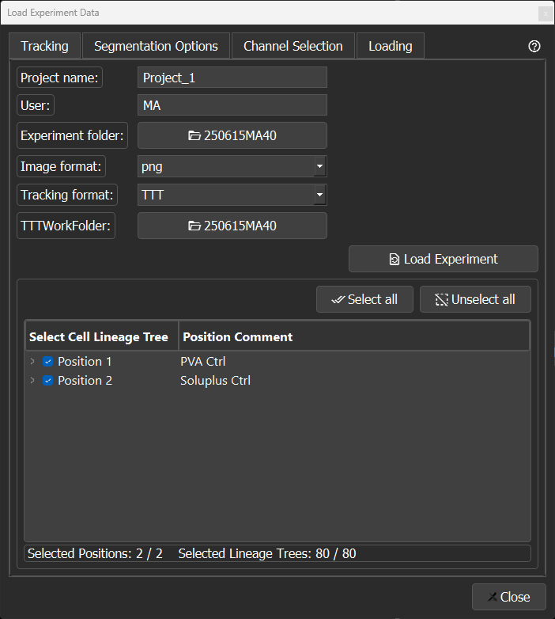
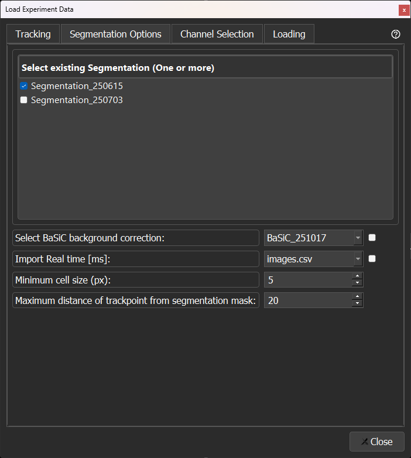
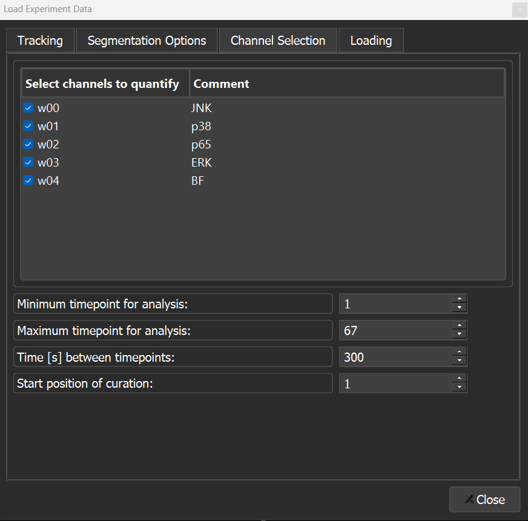
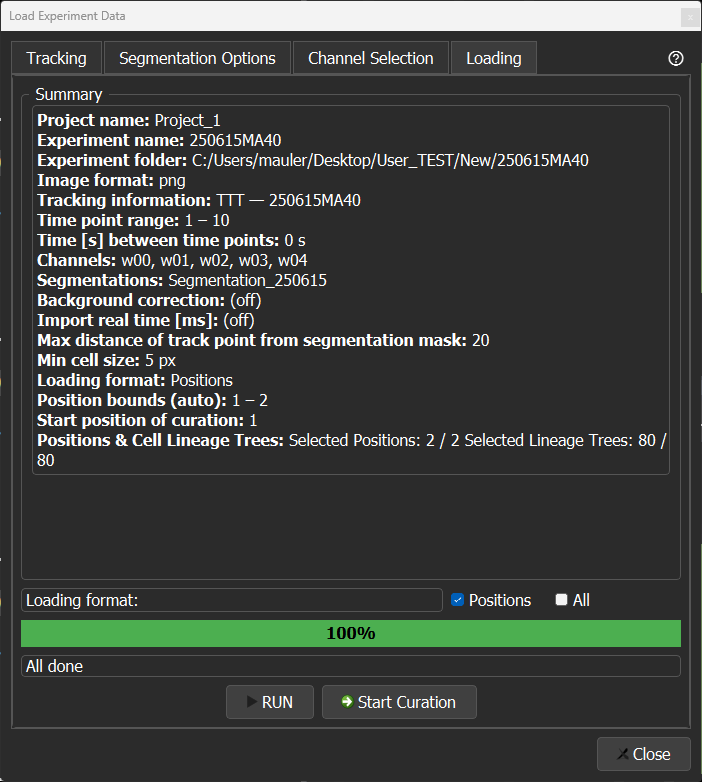
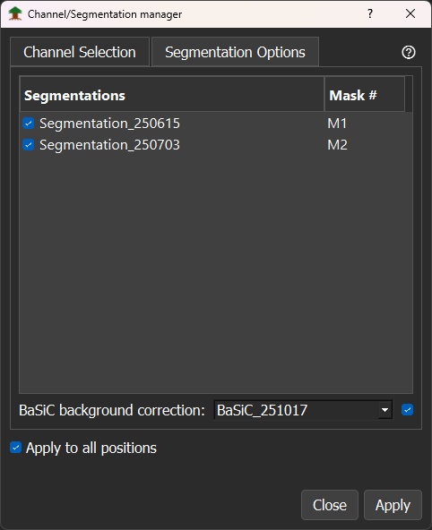
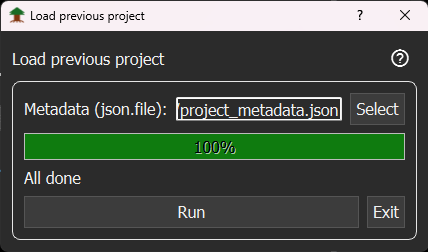

# Loading Window

This window is used to load experiment data, define segmentation and channel settings, and start the quantification and curation workflow. It can be opened through `View → Start a new Project` or `Ctrl + N` .

## Tracking Tab

1. Assign a project name (e.g., Project_1, Project_2, etc.).
2. Enter user initials (e.g., MA or LA).
3. Select the experiment folder (e.g., `20251012MA40`) in the [tTt folder structure](https://github.com/CSDGroup/SECQUOIA/blob/main/docs/data-formats.md).
4. Select the image format for the input images and masks.
5. Select the tracking input format: either [btrack](https://github.com/quantumjot/btrack?tab=readme-ov-file), [Cell Tracking Challenge (CTC)](https://celltrackingchallenge.net/), [tTt](https://bsse.ethz.ch/csd/software/ttt-and-qtfy.html), or [Ultrack](https://github.com/royerlab/ultrack).
6. Select a [tracking folder](https://github.com/CSDGroup/SECQUOIA/blob/main/docs/data-formats.md).
7. Click `Load experiment` to load the tracking data. If the `tTt` tracking format is selected, the position comments are also read from `TATexp.xml`. Only after loading the data are the other tabs enabled.
8. Once the data are loaded, specific Positions and Identifications can be chosen for further data analysis. The number of selected Identifications and Positions is displayed. Use `Select all` or `Unselect all` to select or deselect all Positions and Identifications.

**Note:** Through a right-click on the select button, a file path can be mounted. This is particularly helpful when all experiments are located in the same folder, reducing the number of clicks.

## Segmentation Tab

1. All folders starting with `Segmentation_` located in the `Analysis` folder are automatically detected and displayed as options. Select at least one segmentation folder. Multiple segmentation folders can be selected for quantification and curation.
2. Optional [`BaSic background`](https://github.com/peng-lab/BaSiCPy) selection by checking the checkbox. Folders in the `Analysis` folder starting with `BaSic` are automatically detected and displayed as options.
3. Optional `Real time` selection by checking the checkbox. Data are automatically recognized from `.csv` files starting with `images` if they are located in the experiment folder. This allows switching from time points to the real time at which the image was taken.
4. Define the minimum cell size of the mask. All masks with a smaller size are ignored during the analysis.
5. Define the maximum distance from the tracking point to the segmentation data. If the distance exceeds this threshold, a mask will not be matched to the tracking point.

## Channel Selection Tab

1. All available channels are automatically detected and displayed. Select at least one channel for quantification and curation. If the tTt tracking format is selected, comments from `TADexp.xml` are automatically parsed and displayed.
2. Define the minimum time point.
3. Define the maximum time point.
4. Enter the time interval in seconds between consecutive time points.
5. Define the start position for curation.

## Loading Tab

A summary of all selected parameters for the experiment to be quantified and curated is displayed.

1. Select the loading format: either `Position` or `All`.
   - In `Position` mode, only one position is analyzed, and the next position is analyzed when switching to that position.
   - In `All` mode, all positions are first quantified, which takes longer than quantifying just one position, but no new quantification is needed when switching positions.
2. Click `Run` to load all data and start the quantification.
3. The progress bar indicates when the loading and quantification are finished. Once processing is complete, the `Start Curation` button is enabled.
4. During loading, a project folder is created in the Analysis directory. The loading parameters are saved in `project_metadata.json`, allowing the project to be easily reloaded later.

# Channel/Segmentation manager

Add or remove channels and segmentation masks after a project has already been loaded, without restarting the experiment. Channel and segmentation detection reuse the same logic as the initial loading window, so your original parameters carry over automatically. Open it via `View → Channel/Segmentation manager` or `Ctrl+Shift+C`.

Select the desired channels (`Channel Selection` tab) and segmentations (`Segmentation Options` tab). The checkboxes reflect what's currently loaded, and the mask list shows each selected mask's resulting M-number, updating live as you (de)select. Choose whether to re-quantify `all positions` or just the `current position`, then click `Apply`. This reloads the data, re-runs quantification, refreshes the viewers and dynamics plots, and updates `project_metadata.json` with the new configuration.

# Load Previous Project

The project loading window (`Ctrl+O` or `File → Open a project`) is used to reload a previously saved project.

1. Select the `project_metadata.json` file from your project folder.
2. Click `Run`. The progress bar indicates when the data have been reloaded.
3. Close the window.

