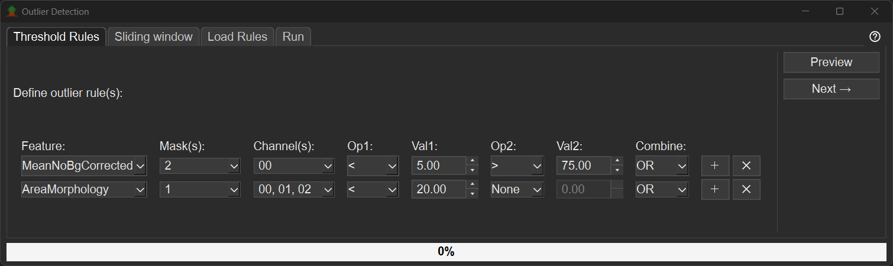
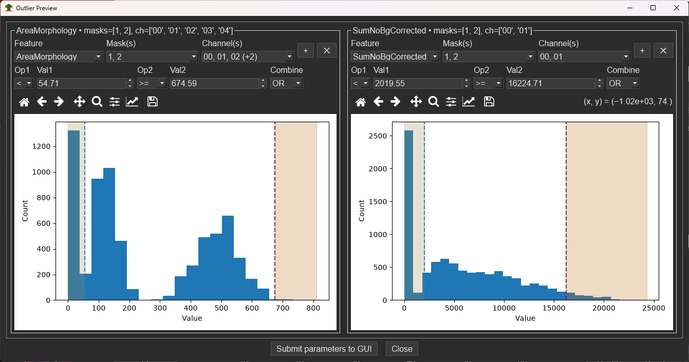
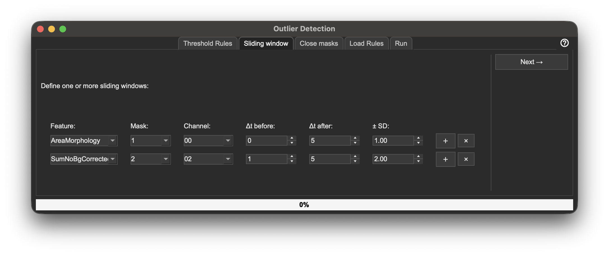
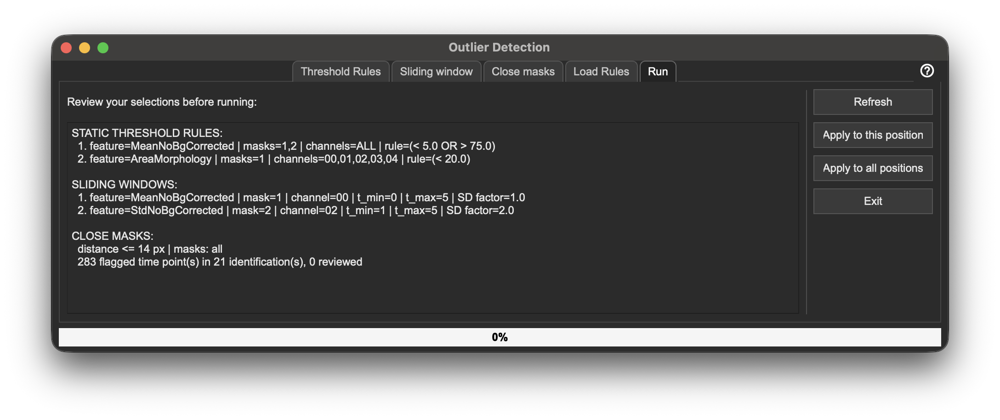
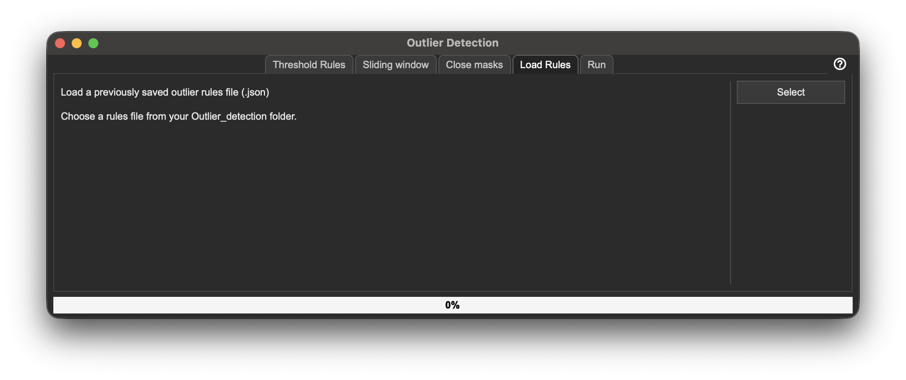

# Outlier Detection

Outlier detection helps you quickly identify technical errors caused by imperfect auto-tracking, segmentation errors, or incorrect assignment of tracking points to masks.

## Outlier Detection Window

The Outlier Detection window can be opened by clicking `Outlier detection → Outlier detection` or pressing `Ctrl+H`.

The Outlier Detection window consists of the following tabs:

- `Threshold rules`
- `Sliding window`
- `Run`
- `Load`

## Threshold Rules Tab

If a value lies outside the defined thresholds, it is marked as an outlier.

1. Select a `Feature`, `Mask`, `Channel`, an operator (`Op1`), and a value (`Value 1`).
2. By entering different parameters into these fields, you define minimum (<) or maximum (>) threshold values.
3. Optionally, a second operator (`Op2`) can be used together with `Op1` to define both a minimum and a maximum threshold.
4. Click the `+` button to add a new row and define additional threshold rules.
5. Click the `X` button to remove the corresponding threshold rule.
6. If no values are entered for a threshold rule, that rule is not applied. A row keeping the default value `0` for `Val1` (and `Val2`, when `Op2` is used) is ignored, so you can leave unused rows in place instead of deleting them.
7. After defining your threshold rules, click `Next` to switch to the `Sliding window` tab.

### Threshold Selection via Histogram Preview

Instead of entering threshold values manually, you can use the `Preview` button to define thresholds interactively.

- Click `Preview` to open a histogram of the selected feature, channel, and mask.
- Move the dotted line(s) in the histogram to select the desired threshold values.
- The same dropdown menus for `Feature`, `Mask`, `Channel`, and operators are available as in the main Threshold rules tab.
- After placing the dotted line(s) at the desired positions, click `Submit parameters to GUI` to send the selected thresholds back to the Threshold rules tab.

## Sliding Window Tab

The `Sliding window` method checks how values change over time within a defined time window.

A sliding window moves from one time point to the next and checks whether the next value lies within a defined tolerance range around the current value ± standard deviation (SD). If a checked value lies outside this tolerance range, it is considered an outlier. If no values are entered for the sliding window, this method will not be used for outlier detection.

To configure the sliding window, specify the following:

1. `Δt before` — The number of time points before the current time point to include in the window.
2. `Δt after` — The number of time points after the current time point to include in the window.
3. `Feature, Channel and Mask` — The feature, mask, and channel used for outlier detection.
4. `Tolerance (SD)` — The allowed deviation (in standard deviations) from the mean within the window.
5. Click `Next` to move to the `Run` tab.

## Run Tab

The `Run` tab displays a summary of all defined rules (both threshold and sliding-window based).

- Click `Refresh` to update the displayed summary.
- Click `Apply` to start the outlier detection.
  - A progress bar indicates the status of the calculations.
  - A `.json` file is created containing all information used for the outlier detection.
  - This file is saved in the `outlier_detection` folder inside the `SECQUOIA` folder in the `Analysis` directory of the current experiment.
- All outlier time points are marked with a yellow star in the plots.
- All Tree-IDs with at least one outlier time point are listed in the `OUT` list.
- Click `EXIT` to close the Outlier Detection window.

## Load Tab

The `Load` tab allows you to reuse previously defined outlier rules.

- Select a `.json` file containing outlier rules.
- After selecting the `.json` file, the tab automatically switches to the `Run` tab and displays the summary of all loaded rules and parameters.

## Shortcuts and Additional Functions

### Jump to Next Outlier

- `Ctrl+Arrow Down`: Jump to the next Tree-ID with at least one outlier.
- `Ctrl+Arrow Up`: Jump to the previous Tree-ID with at least one outlier.
- Within a single Tree-ID:
  - `Ctrl+Arrow Right`: Jump to the next outlier in the current Tree-ID.
  - `Ctrl+Arrow Left`: Jump to the previous outlier in the current Tree-ID.

### Current Parameters

- Using `Outlier detection → Current parameters` opens a popup window showing all currently defined rules.
  - Click `Show plots` to open histograms for all threshold rules.
  - Click `OK` to close the Current parameters window.

### Reset Outliers

Using `Outlier detection → Reset outliers` or `Ctrl+R` removes all outlier rules and clears all outlier selections.
