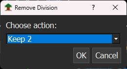
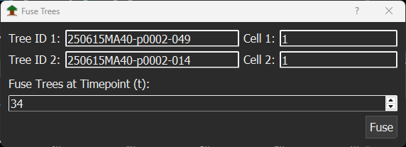

# Tracking

SECQUOIA allows manual tracking and curation of loaded tracking data.

When you right-click on a mask or redraw a mask at a different position, the current x and y coordinates are assigned to the current Tree-ID at the current time point for that track number. Use the menu entries `View → Tracking → Show Tracks`/`Ctrl+Shift+K` or `View → Tracking → Show IDs`/ `Ctrl+Shift+I` to display the tracks of the current Tree-ID and the Tree-IDs themselves, respectively. By choosing `View → Tracking → Tracking bar` or `Ctrl+Shift+B`, the tracking toolbar is added to the Main Window. The tracking toolbar includes the buttons `New ID`, `Division`, `Remove division`, `Split tree`, and `Fuse tree`.

## Tracking toolbar

### New ID

Click the `New ID` button in the tracking bar to generate a new, empty Tree-ID. A new entry is added at the end of the Tree-ID list, and the [dynamics plots](/docs/dynamics-plot.md) automatically switch to this newly created Tree-ID. If no mask is assigned yet, the [viewer](/docs/viewer.md) displays all masks. Right-click a mask to assign it to the new Tree-ID. The assignment is immediately visible in the [Lineage Tree](/docs/lineage-tree.md) window and in the [dynamics plots](/docs/dynamics-plot.md). If a mask is missing, draw a new mask and then add it to the current Tree-ID via right-click.

### Division

When a cell division occurs, click the `Division` or `Ctrl+D` button at the current time point to record it. A division event is added and shown in the [lineage tree](/docs/lineage-tree.md). Next, click on one of the daughter cell nodes in the [Lineage Tree](/docs/lineage-tree.md). Now assign a new mask to that daughter cell by right-clicking an existing mask in the [viewer](/docs/viewer.md) or by drawing a new mask.

### Remove division

The `Remove division` button deletes a cell division of the currently selected cell at the active time point.

When `Remove division` is clicked, a popup window appears asking which daughter cell’s tracking information should be kept. For example, you can choose `Keep2`, `Keep3`, or `None`.
- `Keep2` or `Keep3` keeps the tracking data of the corresponding daughter cell.
- `None` discards all tracking data related to this division.

### Split tree

Click `Split tree` to split the lineage tree at the current time point. The lineage tree is cut at the selected time point. All tracking data up to this time point are kept in the current Tree-ID. All tracking data after the current time point are transferred into a new Tree-ID, which is added to the Tree-ID list.

### Fuse tree

Two Tree-IDs can be fused at the current time point. Click `Fuse tree` to open the Fuse Trees dialog.

An initially empty window appears, where the user can select the Tree-IDs for fusion. By pressing `Ctrl + right-clicking` on a mask with an assigned Tree-ID, that Tree-ID is added to the Fuse Tree window. After selecting both Tree-IDs to be fused, click `Fuse`. Both original trees are merged into a new Tree-ID, and the old Tree-IDs are deleted. The new fused Tree-ID is added to the end of the Tree-ID list.

### Undo (↶)

Reverts the most recent tracking edit — New ID, Division, Remove Division, Split Tree, or Fuse Tree. It only affects tracking/lineage edits, not pixel-mask edits, which have their own separate undo [(`Ctrl+Z`)](/docs/viewer.md).

### Redo (↷)

Re-applies the last tracking edit that was undone with the Undo button. Like Undo, it's scoped to tracking/lineage changes only, separate from mask-editing redo [(`Ctrl+Y`)](/docs/viewer.md).
