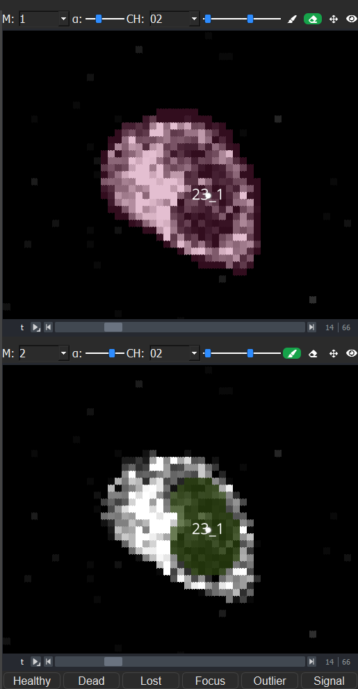
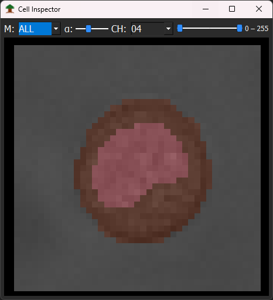

# Viewers

The Main Window contains two [napari-based viewers](https://github.com/napari/napari) on the right side, loaded by default. The size of the napari viewers can be adjusted using the splitter. Each viewer has its own toolbar with the following functions:

- Selecting and displaying different masks and adjusting mask opacity
- Selecting and displaying different channels and adjusting contrast
- Editing masks (erase or paint)
- Navigating and zooming within the image
- Collapsing a viewer using the `eye icon`

## Masks and channels

- Different masks can be displayed by changing the number in the `Mask (M:)` dropdown.
- When `M: ALL` is selected, all masks are displayed simultaneously:
  - In `ALL` mode, masks cannot be edited.
  - Multiple masks can be assigned to the current Tree-ID by right-clicking on overlapping masks.

- The `opacity slider` next to the `Mask (M:)` dropdown (set to `1` by default) controls the opacity of the currently displayed mask.
- The `Channel (CH:)` dropdown next to the opacity slider allows you to select the displayed channel.
- The black and white points of each channel can be adjusted using the slider next to the channel dropdown.
- In staggered acquisition experiments, where channels are imaged at different frequencies, a black image is displayed for missing image channels.

## Navigation and zoom

- The `Pan` tool (hotkey `6`) allows you to zoom in and out and move around within the viewer.
- The `time slider` below each viewer allows to change the current time point.

## Editing masks

Two tools are available for editing masks:

- `Eraser` (button with eraser icon, hotkey `1`) — reduces or completely removes a mask.
- `Paint` (button with pen icon, hotkey `2`) — draws on the currently selected mask or generates a new mask.
- `Space` allows to quickly switch between Eraser and Paint tools.
- While `Paint` or `Eraser` is active, `]` grows and `[` shrinks the selected mask by 1 px.
- Right-clicking on the Paint or Eraser button opens menus to select `Show all masks` or `Create a new mask`:
  - `Show all masks` or `Ctrl + M` — displays all masks.
  - `Create a new Mask` or `M` — draws a new mask with a new Label ID.
- `Ctrl + Z` — undoes the last edits at that time point for that mask.

### Brush size

The size of the eraser and paint brush can be changed using:

- `Alt` + `+` to increase the brush size
- `Alt` + `-` to decrease the brush size

## Cell fate and observation buttons

A row of `cell fate and observation buttons` appears below the second viewer. These buttons allow to annotate cell fates/ cell observation for specific cells.

- By default, `Healthy or H` is assigned as the cell fate for all cells.
- If a cell dies, you can click `Dead or D` to plot an orange `X` in the [lineage tree](/docs/lineage-tree.md) at that time point.
- If a cell is `lost during tracking or L`, you can mark it with `Lost` to plot a `triangle` in the [lineage tree](/docs/lineage-tree.md) at that time point.
- For cells moving `out of focus or F`, an orange `circle` is plotted in the [lineage tree](/docs/lineage-tree.md).
- For `outliers or O`, an orange outlier `star` is added at the corresponding time point.
- For `Signal or K`, LowSignal is added to the [exported .csv files](/docs/data-formats.md) at the corresponding time point.

## Cell Inspector

- The Cell Inspector is an extra window that shows more channel and mask combinations than the two default viewers.
- Open it through `View → Cell Inspector` or by pressing `Ctrl+I`.
- It has the same dropdowns and sliders as the default viewers in the main window, to control which channel and mask to show.
- Right-click inside the Cell Inspector window to open a menu where more viewers can be added or removed.
- This window is for displaying only. Moving the image and editing masks can only be done in the default viewers in the main window.

