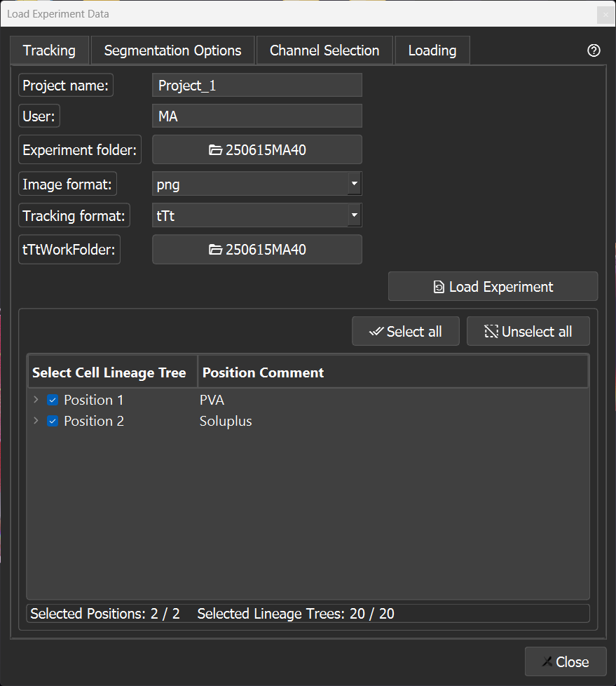
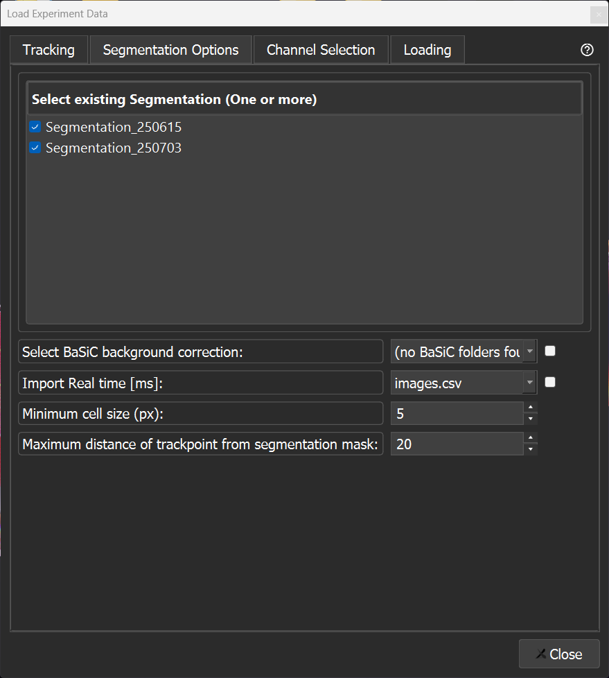
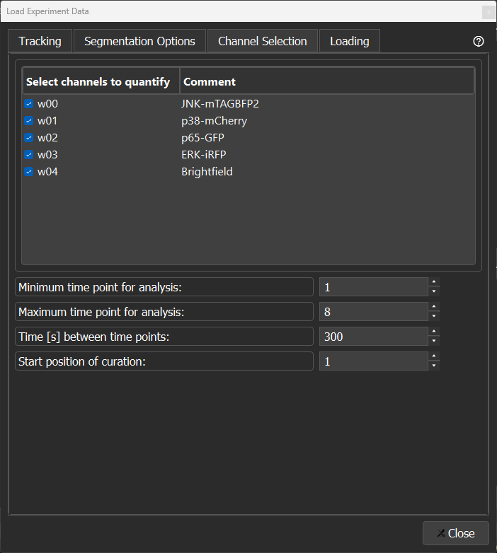
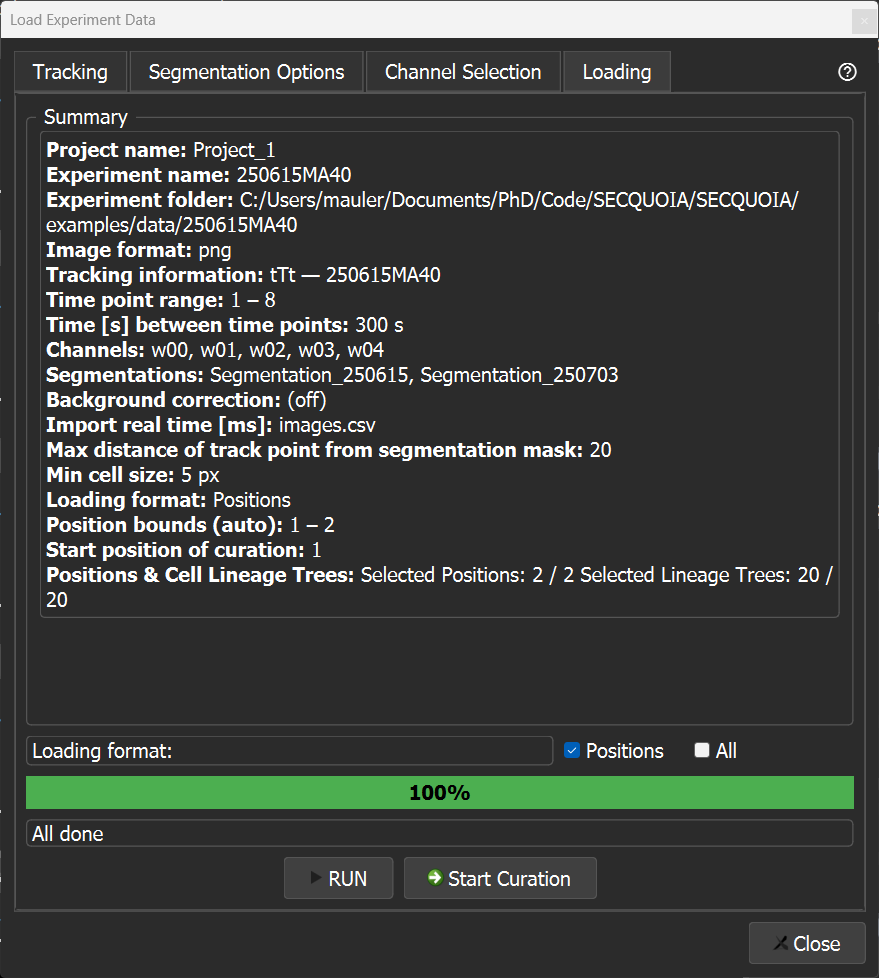

# Demo dataset

SECQUOIA ships with a small demo dataset so you can explore the full workflow (loading, quantification, error curation, image and movie export, and cytometric analysis) without preparing your own experiment first.

| | |
|---|---|
| **Experiment** | `250615MA40` |
| **Positions** | 2 |
| **Channels** | 5 (w00–w04) |
| **Time points** | 1–8 |
| **Segmentation masks** | `Segmentation_250615`, `Segmentation_250703` |
| **Tracking format** | tTt |


## Setup

The dataset is stored as an archive in `SECQUOIA/examples/data/`. Unzip it in place before
first use, from the repository root:

**Windows (PowerShell):**

```powershell
Expand-Archive SECQUOIA\examples\data\250615MA40.zip -DestinationPath SECQUOIA\examples\data
```

**macOS:**

```bash
unzip SECQUOIA/examples/data/250615MA40.zip -d SECQUOIA/examples/data
```

This creates `SECQUOIA/examples/data/250615MA40/`, which follows the standard
[tTt folder layout](../docs/data-formats.md).

## Launching SECQUOIA

1. Activate your conda environment:

```bash
conda activate SECQUOIA
```

2. Launch the application:

```bash
SECQUOIA
```

## Loading the demo data

Open the [loading window](../docs/loading-window.md) via `View → Start a new project`,
or press `Ctrl+N`. The loading window has four tabs. Work through them in order,
using the values below for the demo dataset.

### 1. Tracking tab



1. Assign a project name (for example `Project_1`).
2. Enter user initials (`MA`).
3. Select the experiment folder: `SECQUOIA/examples/data/250615MA40`.
4. Select `.png` as the image format.
5. Select the tracking input format: [tTt](https://bsse.ethz.ch/csd/software/ttt-and-qtfy.html).
6. Select the tracking folder: `250615MA40/Analysis/Tracking_tTt/250615MA40`.
7. Click `Load experiment`.

### 2. Segmentation tab



1. Select one or both segmentations: `Segmentation_250615`, `Segmentation_250703`.
2. (Optional) Enable `Import real time` to read acquisition timestamps from `images.csv`.
3. Set the `minimum cell size`. Masks smaller than this are ignored during analysis (Use `5` for the demo data).
4. Set the `maximum distance` between a tracking point and a segmentation mask. Beyond this threshold, a mask is not matched to the tracking point (Use `20` for the demo data).

### 3. Channel selection tab



1. Select at least one channel for quantification and curation.
2. Set the first time point.
3. Set the last time point.
4. Enter the time interval between consecutive time points (`300` for the demo data).
5. Set the start position to `1` for curation.

### 4. Loading tab



1. Select `Position` as the loading format.
2. Click `Run` to load the data.
3. Proceed with quantification, see the [main README](../README.md) and the [`docs/`](../docs) folder for detailed information.

## Resetting the demo data

Curation writes back to the tracking files, so the demo data changes as you work
with it. To restore the original state, delete the unpacked folder and unzip the
archive again, from the repository root:

**Windows (PowerShell):**

```powershell
Remove-Item -Recurse -Force SECQUOIA\examples\data\250615MA40
Expand-Archive SECQUOIA\examples\data\250615MA40.zip -DestinationPath SECQUOIA\examples\data
```

**macOS:**

```bash
rm -rf SECQUOIA/examples/data/250615MA40
unzip SECQUOIA/examples/data/250615MA40.zip -d SECQUOIA/examples/data
```
